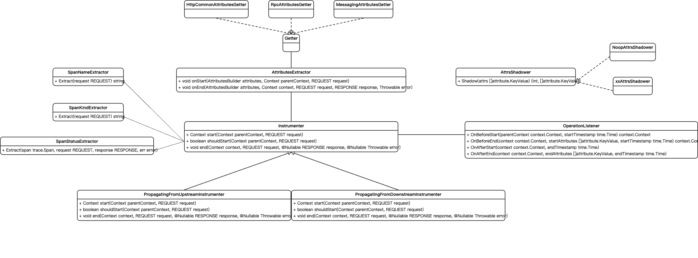

# Project Structure

The project structure is as follows:

```
internal ---> Compile-Time-Instrumentation tools
demo ---> Demo Application
pkg ---> Public API
    inst-api ---> Encapsulation of instrumentation (generating span, metrics, ...)
        instrumenter
    inst-api-semconv ---> Encapsulation of [OpenTelemetry SemConv](https://opentelemetry.io/docs/specs/semconv/)
        instrumenter
            http
            rpc
            db
            messaging
            network
sdk ---> Instrumentation code for each plugin (e.g. http, grpc, ...)
```


For Public API, we have some key abstractions as below:
1. Instrumenter: Unified entrance of instrumentation (generating span, metrics, ...)
2. Extractor: Extracting attributes using multiple Getters according to OpenTelemetry spec.
3. Getter: Getting attributes from the REQUEST object(For example, HttpRequest object that HTTP Server received).
4. AttrsShadower: An extension for Extractor to customize the attributes extracted by the extractor.
5. OperationListener: An hook for better extension(For example, aggregate the metrics)
