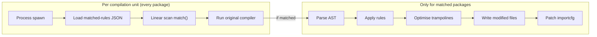

# How-To: Continuous Compile-Time Benchmarking

This document explains the compile-time benchmarking strategy for the project: what is measured, how the scenarios are structured, and how to run benchmarks locally.

## Table of Contents

- [Why compile-time overhead?](#why-compile-time-overhead)
- [Overhead model](#overhead-model)
- [Benchmark scenarios](#benchmark-scenarios)
- [Running benchmarks locally](#running-benchmarks-locally)
- [Measurement methodology](#measurement-methodology)
- [Output format](#output-format)
- [Complementary profiling](#complementary-profiling)

## Why compile-time overhead?

`otelc` instruments Go applications at compile time using `go build -toolexec`. Every package compiled during a build spawns a new `otelc toolexec` process. Even for packages where no instrumentation rules match, the tool still pays a fixed cost:

1. Process spawn.
2. Load the matched-rules JSON file from disk.
3. Linearly scan all rule sets to confirm no match.
4. Execute the original compiler unchanged.

For small projects with only a handful of packages this is negligible. For larger projects the per-unit cost accumulates, making compile-time overhead the primary UX metric to track.

## Overhead model

There are two distinct layers of overhead. The benchmark scenarios are designed to isolate each layer.



## Benchmark scenarios

Scenarios live in `test/bench/scenarios/`:

| Scenario | Dependencies | Instrumented pkgs | What it measures |
| :--- | :--- | :---: | :--- |
| `baseline` | stdlib only (`fmt`) | 0 | Pure scaffolding: setup phase + toolexec passthrough for a small stdlib dep tree, no rule matches. |
| `multi` | `net/http` + gRPC + `database/sql` + Redis + K8S-Client-Go | 6–8 | Worst case: all available instrumentation rules active and exercised simultaneously. |
| `largeidle` | Heavy stdlib + many third-party libs, no matching targets | **0** | "Tax" on large projects: many compilation units all passing through toolexec with zero AST rewriting. |

The `largeidle` scenario is the most important for realistic enterprise codebases where a user enables `net/http` instrumentation but has hundreds of internal or third-party packages that do not match any rule.

## Running benchmarks locally

The benchmarks are Go tests in `test/bench`. Both Make targets build `otelc` first and pass its path and the scenarios directory to the tests through `OTELC_BIN` and `BENCH_SCENARIOS_DIR`.

```bash
# Time plain and otelc builds of every scenario (5 builds each by default).
make benchmark/codspeed

# More builds per scenario for a more stable measurement.
make benchmark/codspeed BENCH_TIME=10x

# Fail if otelc's overhead exceeds the ceiling. This is the check CI runs.
make benchmark/threshold

# Use a different ceiling, in percent.
make benchmark/threshold BENCH_MAX_OVERHEAD_PCT=200
```

To benchmark a single scenario, run `go test` from `test/bench` after `make build`:

```bash
cd test/bench
OTELC_BIN=$PWD/../../otelc \
BENCH_SCENARIOS_DIR=$PWD/scenarios \
  go test -run='^$' -bench='Compile/largeidle' -benchtime=5x
```

## Measurement methodology

Both benchmarks reduce run-to-run noise the same way:

1. **Full rebuilds**: Every build is `go build -a -o app .` (or `otelc go build -a -o app .`) in the scenario directory, so the build cache is bypassed and each run measures end-to-end compile time.
2. **Dependencies first**: `go mod download` runs for each scenario before any timed build.
3. **`GOGC=off`**: Builds run with `GOGC=off` to reduce garbage-collection jitter inside the Go toolchain.

`make benchmark/codspeed` runs `BenchmarkCompile` (`test/bench/bench_test.go`). It has two sub-benchmarks per scenario, `BenchmarkCompile/<scenario>/plain` and `BenchmarkCompile/<scenario>/otelc`, and each runs `BENCH_TIME` builds (default `5x`).

`make benchmark/threshold` runs `TestOverheadCeiling` (`test/bench/overhead_test.go`, behind the `overhead_check` build tag). For each scenario it does one warmup build with each tool, then three timed builds with each, and uses the fastest. A build cannot finish faster than its real cost, so slower runs are treated as noise. The overhead is `(otelc - plain) / plain * 100`.

## Output format

`make benchmark/codspeed` prints standard `go test -bench` results, with the time per build in `ns/op`:

```text
BenchmarkCompile/<scenario>/plain-<GOMAXPROCS>    <builds>    <nanoseconds per build> ns/op
BenchmarkCompile/<scenario>/otelc-<GOMAXPROCS>    <builds>    <nanoseconds per build> ns/op
```

`make benchmark/threshold` logs one line per scenario and fails if any scenario is over its ceiling:

```text
<scenario>: plain=<seconds>s  otelc=<seconds>s  overhead=+<percent>%
```

The ceiling is `BENCH_MAX_OVERHEAD_PCT` (default `150`) for every scenario except `baseline`, which allows up to 550%: `otelc` always injects the OTel SDK initialization package, so even a build with no matching rules pays the one-time cost of compiling the SDK.

In CI, the `Compile-Time Benchmarks` workflow runs `make benchmark/threshold` on pull requests and pushes to `main`, and `make benchmark/codspeed` under CodSpeed (walltime mode) on a nightly schedule.

## Complementary profiling

`otelc` ships built-in pprof support that provides deeper insight into where compile-time cost is spent. Use it alongside the benchmarks when investigating a regression:

```bash
# Collect a CPU profile for the largeidle scenario.
otelc --profile-path="$PWD/profiles" --profile=cpu --profile-summary \
  go build -a ./test/bench/scenarios/largeidle/...

# Open the merged profile.
go tool pprof -http=:8080 profiles/otelc-cpu.pprof
```

See [profiling.md](profiling.md) for the full reference.
